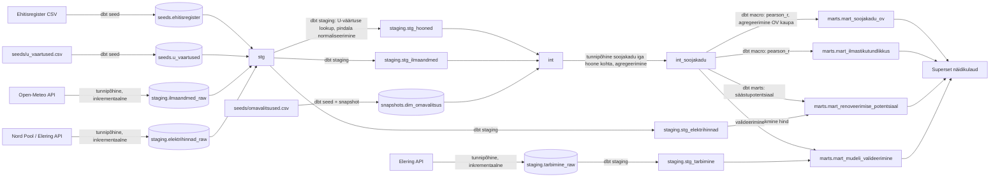

## Äriküsimus
Millistes Eesti omavalitsustes on hooned külmale kõige haavatavamad ning kus oleks renoveerimine kõige suurema energiasäästu potentsiaaliga?

## Mõõdikud
1. Soojakao intensiivsus (kWh/m²/aastas)
2. Ilmastikutundlikkuse indeks (Pearsoni r)
3. Renoveerimise potentsiaal (€)
4. Mudeli valideerimine (Pearsoni r + KAV)

## Andmeallikad
| Allikas | Tüüp | Sagedus | Roll |
|---------|------|---------|------|
| [Ehitisregister](https://livekluster.ehr.ee/ui/ehr/v1/infoportal/buildingdata) | CSV (staatiline) | Ühekordne | ~300000 hoonet — ehitusaasta, pindala, asukoht |
| [Open-Meteo](https://open-meteo.com) | REST API | Tunnipõhine | Välistemperatuur 6 ilmajaamast |
| [Elering — tarbimine](https://dashboard.elering.ee/api/system/with-plan) | REST API | Tunnipõhine, inkrementaalne | Tegelik riiklik tunnitarbimine (MWh) |
| [Elering — Nord Pool](https://dashboard.elering.ee/api/nps/price) | REST API | Päevapõhine | Eesti börsielektri hind (€/MWh) |

## Andmevoog

## Andmebaasi kihid

| Kiht | Materiaalsus | Roll | Võtmetehnika |
|------|-------------|------|-------------|
| `staging` (raw) | Tabel | Open-Meteo API, Elering API, Nord Pool API toorkuju. Ehitisregister laetakse `seed`-ina — ~300000 rida. | UPSERT, `loaded_at` ajatempel |
| `staging` (dbt) | Vaade | `stg_hooned`: Ehitisregistri andmete puhastamine (tühjad väljad, vigased ehitusaastad), U-väärtuse lookup perioodi järgi, omavalitsuse koodi normaliseerimine | `CASE WHEN` lookup U-väärtuse makro, `LEFT JOIN` dimensioonidele |
| `intermediate` | Vaade | `int_soojakadu`: soojakao arvutus iga hoone ja iga tunni kohta: `U × pindala × (21 − T_väljas)`. Agregeerimine omavalitsuse ja tunni kaupa. Arvutusmaht ~300000 hoonet × 8760 tundi aastas — optimiseerimine vajalik. | Agregaatfunktsioonid, `SUM()` partitsioonide kaupa, ajaline filtratsioon |
| `marts` | Tabel | Neli analüütilist tabelit: OV soojakadu, ilmastikutundlikkus, renoveerimispotentsiaal, mudeli valideerimine | `pearson_r` makro, aknafunktsioonid, `CORR()` |
| `snapshots` | Tabel (dbt) | `dim_omavalitsus` ajalooliste muutuste jälgimine (omavalitsuste ühinemised) | `dbt snapshot`, SCD Type 2 |

## Tööjaotus

| Roll | Vastutus | Täitja |
|------|----------|--------|
| Andmeallika omanik | Kirjutab sissevõtu loogika, hoiab API-t töös | Toel Teemaa |
| Transformatsioonide omanik | Kirjutab mart kihi mudelid ja mõõdikute arvutuse | Erkki Laaneoks |
| Kvaliteedi omanik | Kirjutab testid ja vaatab läbi ebaõnnestunud kontrollid | Mihkel Nugis |
| Näidikulaua omanik | Ehitab näidikulaua ja seob selle äriküsimusega | Anna-Liisa Altmets |

## Riskid

| Risk | Mõju | Maandus |
|------|------|---------|
| Ehitisregistri andmed on puudulikud (~10–15% hoonetel puudub ehitusaasta või pindala) | Soojakadu ei saa nende hoonete kohta arvutada | `dbt test` kontrollib tühjade väljade osakaalu omavalitsuste lõikes. Puuduvate andmetega hooned filtreeritakse välja, osakaal dokumenteeritakse. |
| U-väärtuste standardtabel on lihtsustus (hoonete tegelik seisukord võib erineda) | Mudeli täpsus kannatab | Tabelisse salvestatud väärtused on hinnangulised. Kõik omavalitsused kasutavad sama tabelit — suhteline pingerida kehtib ka ligikaudsete väärtustega. Vajab hilisemat valideerimist autoriteetsete allikatega (EVS standardid, riiklik määrus, mõõdistusandmed). |
| Agregeeritud arvutus päeva keskmise temperatuuriga kaotab tunnipõhise detailsuse. | Tippkoormuse analüüs pole võimalik. | Projekti fookus on piirkondlik pingerida, mitte tippkoormus. Päevane täpsus on piisav. |
| Omavalitsuste ühinemised muudavad võrdlust aastate lõikes. | 2017. aasta reformi järgsed piirid erinevad varasematest. | `dbt snapshot` dimensioonil `dim_omavalitsus`. Analüüs tehakse praeguste piiride järgi. |
| Open-Meteo tasuta limiit (10 000 päringut/päev). | Andmed ei uuene. | 6 ilmajaama × 1 päring/päev (kogu tunnid ühes päringus) = 6 päringut päevas — 0.06% limiidist. |
| Elering API muudatused. | Elektrihinna andmed ei uuene, renoveerimise arvutus kasutab viimast teadaolevat hinda. | API on olnud stabiilne aastaid. Mart kasutab `AVG()` üle kõigi andmete — üksikud puuduvad tunnid ei moonuta tulemust. |

## Privaatsus ja turve

Kõik kasutatavad andmed on avalikud.
Andmebaasi ja API paroolid salvestatud .env failis.
.env fail on deklareeritud .gitingore's.
